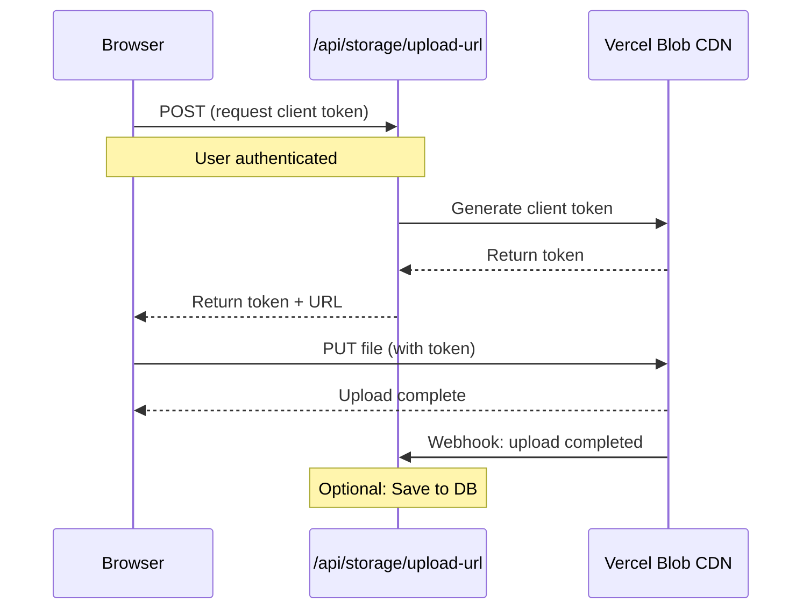
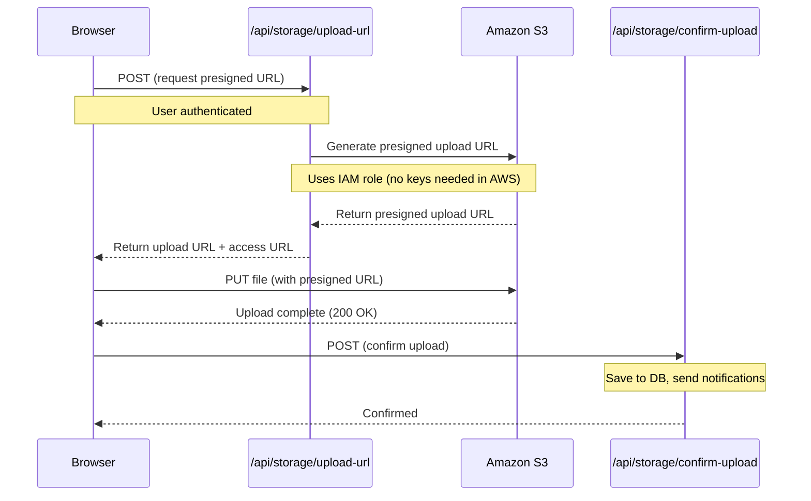

# File Storage Setup

> **Note**: This documentation was written by Claude 3.5 Sonnet.

This project supports **cloud-based file storage** for handling file uploads and downloads.

## Overview

**Storage Access Models:**

- **Vercel Blob**: Files are stored with **public access** by default, making them accessible via permanent public URLs
- **S3**: Files are stored **privately** and accessed via presigned URLs that expire after 7 days

## Storage Drivers

The project supports two storage backends:

- **Vercel Blob** - Default for all deployments (recommended for Vercel/non-AWS)
- **S3** - AWS S3 and S3-compatible storage (MinIO, DigitalOcean Spaces, etc.)

**Vercel Blob** is the default storage driver and works seamlessly in both local development and production environments.

## Configuration

### Environment Variables

```ini
# Storage driver selection (defaults to vercel-blob)
FILE_STORAGE_TYPE=vercel-blob # or s3

# Optional: Subdirectory prefix for organizing files
FILE_STORAGE_PREFIX=uploads

# === Vercel Blob (FILE_STORAGE_TYPE=vercel-blob) ===
BLOB_READ_WRITE_TOKEN=<auto on Vercel>
VERCEL_BLOB_CALLBACK_URL= # Optional: For local webhook testing with ngrok

# === S3 (FILE_STORAGE_TYPE=s3) ===
FILE_STORAGE_S3_BUCKET=your-bucket-name
FILE_STORAGE_S3_REGION=us-east-1  # Optional, defaults to us-east-1

# Credentials (only needed if NOT running in AWS with IAM roles)
# When running on ECS/EC2/Lambda, IAM roles are automatically used
# For local dev, use ~/.aws/credentials file instead of env vars:
# AWS_PROFILE=your-profile-name  # Optional: use a named profile
```

### Quick Start with Vercel Blob

Vercel Blob works in both local development and production environments:

1. Go to your Vercel project → **Storage** tab
2. Click **Connect Database** → **Blob** → **Continue**
3. Name it (e.g., "Files") and click **Create**
4. Pull environment variables locally:

```bash
vercel env pull
```

That's it! File uploads will now work seamlessly in both development and production.

### Quick Start with S3

S3 automatically uses IAM roles when running in AWS (ECS, EC2, Lambda). For local development or non-AWS environments, you'll need access keys.

**Important**: S3 files are stored **privately** and accessed via presigned URLs (expire after 7 days). No public bucket policy is required.

#### Running in AWS (Production)

1. Create a **private** S3 bucket (do NOT configure for public access)
2. Attach an IAM role to your ECS task/EC2 instance/Lambda with S3 permissions:

```json
{
  "Version": "2012-10-17",
  "Statement": [
    {
      "Effect": "Allow",
      "Action": ["s3:ListBucket", "s3:*Object*"],
      "Resource": [
        "arn:aws:s3:::your-bucket-name",
        "arn:aws:s3:::your-bucket-name/*"
      ]
    }
  ]
}
```

3. Set environment variables:

```bash
FILE_STORAGE_TYPE=s3
FILE_STORAGE_S3_BUCKET=your-bucket-name
FILE_STORAGE_S3_REGION=us-east-1
```

No access keys needed! The AWS SDK automatically uses the IAM role.

4. **Important**: Configure CORS for client-side uploads:

**CORS Configuration** (required for browser uploads):

```json
[
  {
    "AllowedHeaders": ["*"],
    "AllowedMethods": ["PUT", "POST", "DELETE", "HEAD"],
    "AllowedOrigins": ["https://yourdomain.com", "http://localhost:3000"],
    "ExposeHeaders": ["ETag"],
    "MaxAgeSeconds": 3000
  },
  {
    "AllowedMethods": ["GET", "HEAD"],
    "AllowedOrigins": ["*"],
    "AllowedHeaders": [],
    "MaxAgeSeconds": 3000
  }
]
```

**Note**: The `ExposeHeaders: ["ETag"]` is **required** for uploads to work. Without it, browser uploads will fail with a network error.

**S3 Bucket Settings:**

- ✅ **Block all public access**: ENABLED (files stay private)
- ✅ **Bucket ACLs**: Disabled (recommended - "Bucket owner enforced")
- ✅ **Access**: Via presigned URLs only (generated server-side)

#### Local Development

For local development, use AWS credentials file and profiles:

1. Create an IAM user with the same S3 permissions above
2. Generate access keys
3. Configure your AWS credentials file (`~/.aws/credentials`):

```ini
[default]
aws_access_key_id = your-access-key
aws_secret_access_key = your-secret-key

# Or use a named profile
[your-profile-name]
aws_access_key_id = your-access-key
aws_secret_access_key = your-secret-key
```

4. Set environment variables:

```bash
FILE_STORAGE_TYPE=s3
FILE_STORAGE_S3_BUCKET=your-bucket-name
FILE_STORAGE_S3_REGION=us-east-1

# Optional: Use a named profile instead of [default]
AWS_PROFILE=your-profile-name
```

The AWS SDK will automatically read credentials from `~/.aws/credentials`. No need for `AWS_ACCESS_KEY_ID` and `AWS_SECRET_ACCESS_KEY` environment variables!

## Client Upload

The `useFileUpload` hook **automatically selects the optimal upload method** based on your storage backend:

- **Vercel Blob**: Direct browser → CDN upload (fastest, default)
- **S3**: Presigned URL upload (direct browser → S3)

```tsx
"use client";

import { useFileUpload } from "hooks/use-presigned-upload";

function FileUploadComponent() {
  const { upload, isUploading } = useFileUpload();

  const handleFileChange = async (e: React.ChangeEvent<HTMLInputElement>) => {
    const file = e.target.files?.[0];
    if (!file) return;

    const result = await upload(file);
    if (!result) return; // Upload failed (error shown via toast)

    // File uploaded successfully
    console.log("File URL:", result.url); // Public URL for Vercel Blob, presigned URL for S3
    console.log("Pathname (key):", result.pathname);
  };

  return (
    <input type="file" onChange={handleFileChange} disabled={isUploading} />
  );
}
```

### Upload Flow

#### Vercel Blob (Direct Upload)



#### S3 (Presigned URL Upload)



### Features

- ✅ **Cloud-Based Storage**: Vercel Blob (CDN) or S3 (private)
- ✅ **Works Everywhere**: Same storage in development and production
- ✅ **Direct Client Upload**: Browser uploads directly (fastest)
- ✅ **Flexible Access**: Public URLs (Vercel Blob) or presigned URLs (S3)
- ✅ **Authentication**: Users must be logged in to upload
- ✅ **Collision Prevention**: UUID-based file naming
- ✅ **Type Safety**: Full TypeScript support with unified interface

## Server-Side Upload

For server-side uploads (e.g., programmatically generated files):

```ts
import { serverFileStorage } from "lib/file-storage";

const result = await serverFileStorage.upload(buffer, {
  filename: "generated-image.png",
  contentType: "image/png",
});

console.log("File URL:", result.sourceUrl); // Public URL for Vercel Blob, presigned URL (7-day expiry) for S3
```

## Upload Completion Tracking

### Vercel Blob (Webhook)

The `/api/storage/upload-url` endpoint handles the `onUploadCompleted` webhook from Vercel Blob. You can add custom logic here:

```ts
// src/app/api/storage/upload-url/route.ts

onUploadCompleted: async ({ blob, tokenPayload }) => {
  const { userId } = JSON.parse(tokenPayload);

  // Save to database
  await db.files.create({
    url: blob.url,
    pathname: blob.pathname,
    userId,
    size: blob.size,
    contentType: blob.contentType,
  });

  // Send notification
  // await sendNotification(userId, "File uploaded!");
};
```

### S3 (Client Callback)

Since S3 doesn't have built-in webhooks like Vercel Blob, the client automatically calls `/api/storage/confirm-upload` after successful upload. You can add custom logic here:

```ts
// src/app/api/storage/confirm-upload/route.ts

export async function POST(request: Request) {
  const session = await getSession();
  const body = await request.json();

  // Save to database
  await db.files.create({
    userId: session.user.id,
    key: body.key,
    url: body.url,
    filename: body.filename,
    contentType: body.contentType,
    size: body.size,
    uploadedAt: new Date(),
  });

  // Send notification
  // await sendNotification(session.user.id, "File uploaded!");

  return NextResponse.json({ success: true });
}
```

**Note**: The client callback approach means uploads can succeed without confirmation if the client closes/crashes. For mission-critical tracking, consider S3 Event Notifications → SNS → Lambda.

## Advanced

### Local Development with Vercel Blob Webhooks

To test Vercel Blob's `onUploadCompleted` webhook locally, use [ngrok](https://ngrok.com/):

```bash
# Terminal 1: Start your app
pnpm dev

# Terminal 2: Start ngrok
ngrok http 3000

# Add to .env.local
VERCEL_BLOB_CALLBACK_URL=https://abc123.ngrok-free.app
```

Without ngrok, uploads will work but `onUploadCompleted` won't be called locally.

### Custom Storage Backend

To implement a custom storage driver (e.g., Cloudflare R2, MinIO, S3):

1. Create a new file in `src/lib/file-storage/` (e.g., `r2-file-storage.ts`)
2. Implement the `FileStorage` interface from `file-storage.interface.ts`
3. Add your driver to `index.ts`
4. Update `FILE_STORAGE_TYPE` environment variable

The `FileStorage` interface provides:

- `upload()` - Server-side file upload
- `createUploadUrl()` - Generate presigned URL for client uploads (optional)
- `download()`, `delete()`, `exists()`, `getMetadata()`, `getSourceUrl()`

### Storage Comparison

| Feature              | Vercel Blob         | S3                          |
| -------------------- | ------------------- | --------------------------- |
| Direct Client Upload | ✅ Yes              | ✅ Yes (presigned URLs)     |
| File Access          | ✅ Public URLs      | 🔒 Private (presigned URLs) |
| URL Expiry           | ❌ Never            | ⏱️ 7 days                   |
| CDN                  | ✅ Global           | ✅ CloudFront (optional)    |
| Cost                 | Pay-as-you-go       | Pay-as-you-go               |
| Best For             | Vercel deployments  | AWS/self-hosted/private     |
| Setup Complexity     | Minimal             | Moderate                    |
| Local Development    | ✅ Works with token | ✅ Works (credentials file) |
| IAM Role Support     | N/A                 | ✅ Yes                      |
| Upload Tracking      | ✅ Webhook          | 🟡 Client callback          |
| Public Access Policy | Required            | ❌ Not needed (private)     |

## Why Not Local Filesystem?

Local filesystem storage is **not supported** because:

1. **AI APIs can't access localhost**: When AI APIs receive `http://localhost:3000/file.png`, they cannot fetch the file
2. **Serverless incompatibility**: Platforms like Vercel don't support persistent filesystem
3. **No CDN**: Files aren't globally distributed

**Solution**: Vercel Blob provides a free tier and works seamlessly in both local development and production. Simply run `vercel env pull` to get your token locally.
